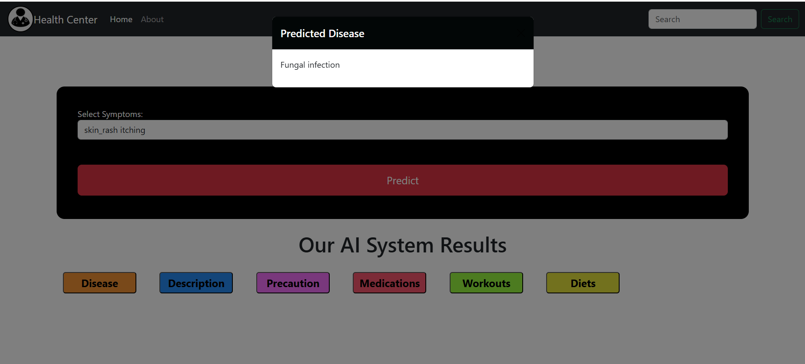
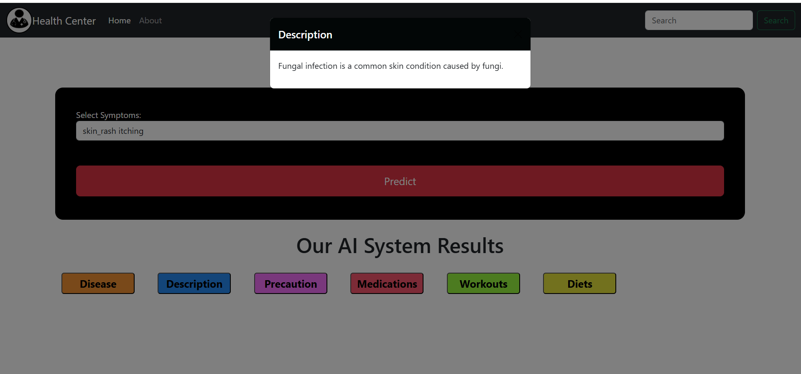
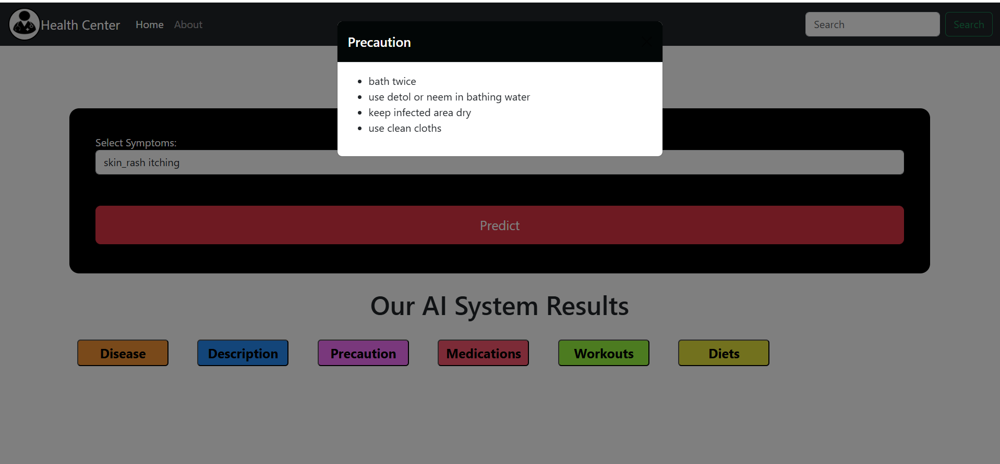
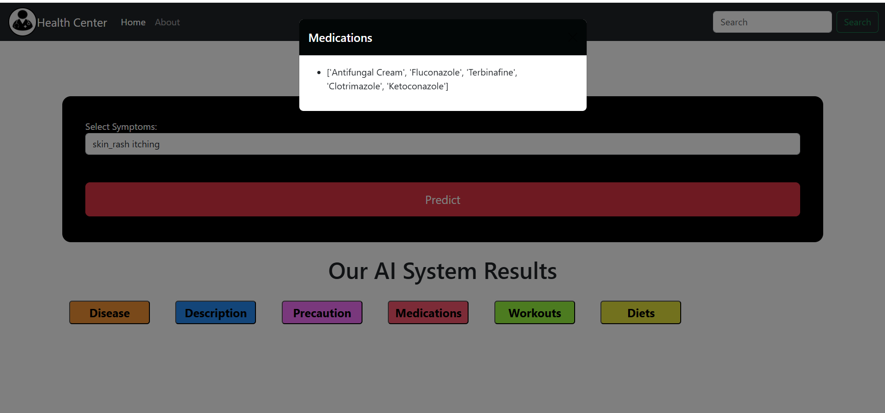
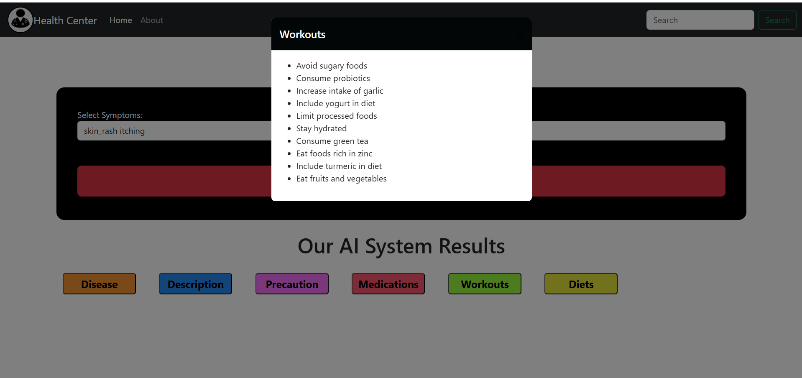

# <u>HealthMate: AI Disease Prediction</u>
This system provides users with a personalized approach to health management by offering predictions of potential diseases based on symptoms inputted by the user. It goes a step further by detailing the predicted disease, recommending medications, suggesting diet plans, outlining precautions, and providing workout routines tailored to the individual's needs.
    

